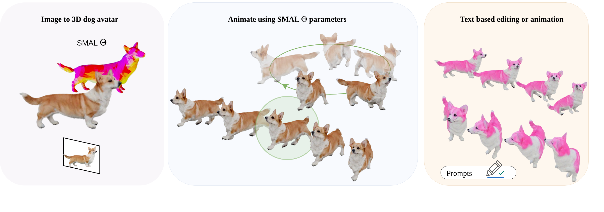

<h1>SMAL-pets: SMAL Based Avatars of Pets from Single Image</h1>
Piotr Borycki*, Joanna Waczyńska*, Yizhe ZHU, Yongqiang Gao, Przemysław Spurek

(* denotes equal contribution)

  

**Abstract:** 
Creating high-fidelity, animatable 3D dog avatars remains a formidable challenge in computer vision. Unlike human digital doubles, animal reconstruction faces a critical shortage of large-scale, annotated datasets for specialized applications. Furthermore, the immense morphological diversity across species, breeds, and crosses, which varies significantly in size, proportions, and features, complicates the generalization of existing models. Current reconstruction methods often struggle to capture realistic fur textures. Additionally, ensuring these avatars are fully editable and capable of performing complex, naturalistic movements typically necessitates labor-intensive manual mesh manipulation and expert rigging.
This paper introduces , a comprehensive framework that generates high-quality, editable animal avatars from a single input image. Our approach bridges the gap between reconstruction and generative modeling by leveraging a hybrid architecture. Our method integrates 3D Gaussian Splatting with the SMAL parametric model to provide a representation that is both visually high-fidelity and anatomically grounded. We introduce a multimodal editing suite that enables users to refine the avatar's appearance and execute complex animations through direct textual prompts. By allowing users to control both the aesthetic and behavioral aspects of the model via natural language, SMAL-pets provides a flexible, robust tool for animation and virtual reality.  

## ✅ Project Status
This repository contains:
- [ ] Code Published
- [ ] Project pages with examples
- [x] Paper published on arXiv
